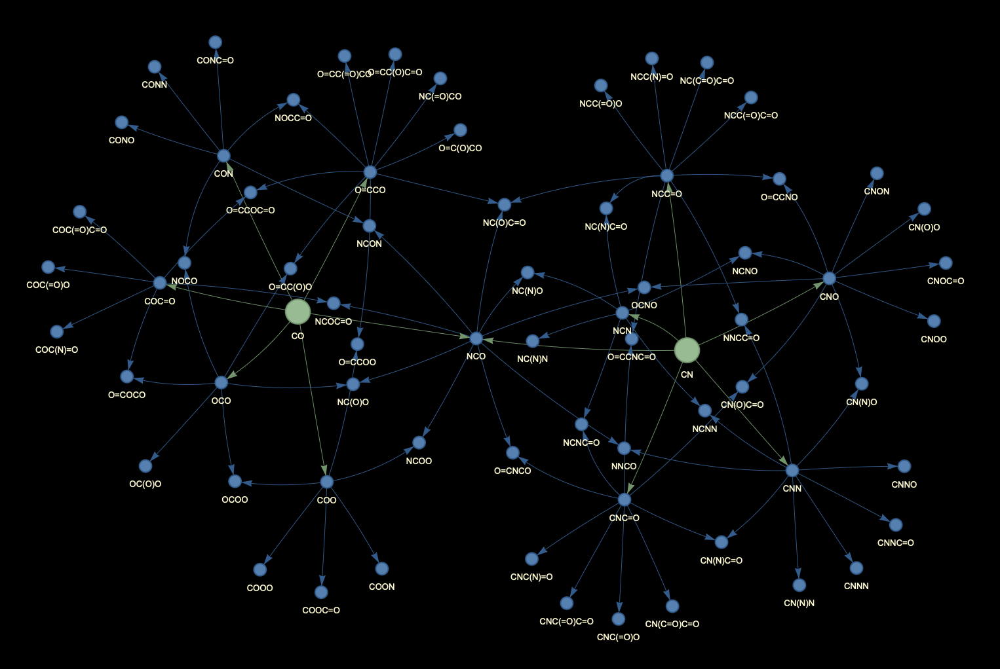

# pSprout 

Ever wondered what would happen if you took a molecule and stuck fragments on it - say, a hydroxyl group, an amine, a methyl? - and if you kept on doing it, over and over again, until you have built yourself a zoo of related molecules? **pSprout** does just that for you. Systematically. Give it a starting molecule (or several) to define a *chemical space*. Add a handful of chemical modifications, and it grows out a whole tree of plausible molecular variants for you to inspect, visualize, or pass on to your predictive models.

pSprout is built on [RDKit](https://www.rdkit.org/) for the actual chemistry, and it uses [NetworkX](https://networkx.org/) to keep track of all this in a graph: *molecules* are nodes, *modifications* are the edges connecting them. That graph can be explored, pruned down to the bread-and-butter connections, and rendered as an interactive diagram (using [PyVis](https://pyvis.readthedocs.io/) or a static plot.

> **Status: under active development.** pSprout is an early-stage research tool. Its API, bundled modification libraries, and graph behavior may change between versions. Treat generated structures as computational candidates and validate chemical feasibility independently. Look into [SynKit](https://github.com/TieuLongPhan/SynKit) or [NOCTIS](https://chemrxiv.org/doi/10.26434/chemrxiv-2025-t20lz) for more reaction informatics, chemical reaction network (CRN) analysis, and fragment-based molecular generation.

## The concept

The basic motivation:

> Given one or more molecules of interest, how can you explore structurally related molecules that were generated from a defined set of transformations?

*pSprout* turns these molecules into the pillars spanning a chemical space (called *support molecules*). The central data structure is `Space`, which holds a network of `MoleculeNode`s that may be connected through `ModificationEdge`s. Speaking in graph theory, it's a *directed acyclic graph (DAG)* where nodes are molecules and directed edges lead from a parent molecule to a "metabolite". When we apply modifications, say additions or substitutions, and update the graph accordingly, we come up with a *provenance-aware chemical network space*. And we can ask questions like:

- What do I have to do *molecule A* to get to *molecule B*?
- What are the most useful modifications to explain the relationship between a class of molecules, e.g. synthetic opioids?
- Are any of the generated molecules available for *in vitro* experiments?

'MoleculeNode' automatically generates a couple of basic descriptors (molecular mass, counts of hydrogen bond donors / acceptors, etc.) and can carry metadata for later inspection. They are identified by their canonical SMILES for now.  `Modification Node` use [Reaction SMARTS](https://www.daylight.com/dayhtml/doc/theory/theory.smarts.html) to specify the transformation, along wih a pinch of metadata.

Space is filled by running `Agent`s. They can range from greedy and expansive (`ExhaustiveExpansionAgent`) and random chases (`RandomWalkAgent`) to more focused approaches (`BeamSearchAgent`). Agents generate `Proposal`s that form a search frontier. Depending on the agent's goals, it can *"realize()"* any number or all of them, adding them to the `Space`. `Metrics` help agents evaluate their state and make choices.

### Simple structure generations

Start off with a single support molecule and have agents create modifications. Much like other chemical reactors, just more focused on provenance.

### Filling chemical spaces

Give it several possibly related molecules. Say, a drug class. Then, instead of creating a DAG for each support molecule (the default behavior of an agent is to reject proposals of an existing molecule), allow for cycles. The agent can then build bridges from one support to another. This more clearly delineates your space. And it lets you populate it with other similar structures (increasing the number of molecules with chemical similarity). Helpers exist to prune and focus the graph.

### Workflows
Export your spaces as plots, SMILES tables, interactive visualizations, or produce .GML files to process in tools like [Gephi](https://gephi.org/).

## What You Can Do

- Start with one or more support molecules represented as SMILES.
- Load bundled or custom reaction-SMARTS modification libraries.
- Expand a chemical space exhaustively, randomly, or with objective-guided beam search.
- Retain the provenance of every generated molecule and modification step.
- Prune an expansion to paths that connect support molecules.
- Calculate average pairwise molecular similarity.
- Render the space as an interactive HTML network or a static molecular-structure plot.


When expansions from distinct support molecules reach a common product, their branches can merge into a single network:



## Installation

pSprout requires Python 3.13 or later. Check out the repository, and install the development dependencies:

```bash
pip install -r requirements.txt
```

The repository also includes `Overview.ipynb`, which demonstrates defining modifications, generating spaces, and visualizing results.

## Quick Start

Create a space from support molecules, load a few transformations, and expand for two iterations:

```python
from psprout import ExhaustiveExpansionAgent, GraphStyle, Space
from psprout.modifications import ModificationLibrary

library = ModificationLibrary.load("simple")

space = Space(support_molecules=["c1ccccc1", "CO"])
agent = ExhaustiveExpansionAgent(
    space,
    [library.AddHydroxyl, library.AddFormyl, library.AddAmino],
)

for _ in agent.run(max_iterations=2):
    pass

print(space.list_smiles())
space.view(style=GraphStyle.dark()).to_html("graph.html")
```

The result is a directed graph: nodes represent canonicalized molecules and edges record the modification that created each product.

## Define a Chemical Space

`Space` is the central container. It accepts an iterable of valid SMILES strings, adds them as support nodes, and stores generated molecules in a directed NetworkX graph.

```python
from psprout import Space

space = Space(support_molecules=["c1ccccc1", "CO"])
graph = space.get_graph()
all_smiles = space.list_smiles()
```

Support molecules are identified in node metadata. This allows later pruning and analysis to focus on the relationships between the molecules you started with.

## Modifications and Libraries

Modifications describe the transformations pSprout can apply. Bundled reaction-SMARTS libraries are available under the names `"simple"` and `"library"`.

```python
from psprout.modifications import ModificationLibrary

library = ModificationLibrary.load("simple")
AddHydroxyl = library.AddHydroxyl

# Equivalent symbol lookup
AddAmino, AddFormyl = library["AddAmino", "AddFormyl"]
```

To load your own YAML library, use `ModificationLibrary.load_yaml()`:

```python
custom_library = ModificationLibrary.load_yaml("path/to/your/modifications.yaml")
```

Libraries can be iterated over, filtered by modification type with `of_type()`, and combined with `|`. Refer to the bundled YAML files for the expected reaction-SMARTS library format.

## Choose an Expansion Agent

Agents decide which valid proposals are added to the graph and used as the next expansion frontier. Iterating over `agent.run()` yields an `AgentState`, so you can inspect progress or stop early.

| Agent | Best suited to | Behavior |
| --- | --- | --- |
| `ExhaustiveExpansionAgent` | Small, complete explorations | Keeps every valid, unique product. |
| `RandomWalkAgent` | Compact and varied sampling | Samples a limited number of proposals per frontier molecule. |
| `BeamSearchAgent` | Objective-driven exploration | Scores proposals and retains the top `beam_width` candidates. |

`BeamSearchAgent` requires an `Objective` to score candidate proposals. `RandomWalkAgent` accepts a seed for reproducible sampling:

```python
from psprout import RandomWalkAgent, Space
from psprout.modifications import ModificationLibrary

lib = ModificationLibrary.load("simple")
space = Space(support_molecules=["c1ccccc1"])
agent = RandomWalkAgent(
    space,
    [lib.AddHydroxyl, lib.AddFormyl, lib.AddAmino],
    k=2, # number of proposals to keep
    seed=42, # rng
)

for state in agent.run(max_iterations=2):
    print(f"Iteration {state.iteration}: {len(state.frontier)} new molecules")
```

## Focus the Network

Exhaustive expansions can quickly become large. When working with multiple support molecules, prune the graph to the molecules that participate in connections between them:

```python
# Keep every node and edge on a path between support molecules.
space.prune_to_support_paths()

# Or retain only shortest connecting paths.
space.prune_to_shortest_support_paths()
```

Both methods modify the current graph in place. Pruning is most informative when branches from different support molecules converge; it does not generate new connections.

Note that this is currently unoptimized. Runtime quickly explodes.

## Measure Similarity

`Space.calculate_similarity()` returns the average pairwise Tanimoto similarity over the molecules currently in the graph, using RDKit fingerprints:

```python
similarity = space.calculate_similarity()
```

Compare this value before and after pruning to get a coarse indication of the diversity removed from the space.

## Trace Provenance

Every graph edge records the modification used to create its product. You can therefore recover a route to a molecule or identify transformations that recur across a pruned network.

```python
from collections import Counter
import networkx as nx

graph = space.get_graph()
path = nx.shortest_path(graph, 
                        source=support_smiles, 
                        target=target_smiles)
provenance = [
    graph.edges[source, target]["modification"]
    for source, target in zip(path, path[1:])
]

space.prune_to_support_paths()
toolbox = Counter(modification for _, _, modification in graph.edges(data="modification"))
print(toolbox.most_common())
```

This provenance distinguishes a pSprout space from a flat list of generated structures: it explains how candidates relate to the support molecules and which transformations contributed to those relationships.

## Visualize a Space

`space.view()` returns a `SpaceView`. Select a built-in style and layout, then render it in the format you like:

```python
from psprout import GraphStyle

view = space.view(style=GraphStyle.dark(), layout="tree")

view.to_html("graph.html")   # Interactive PyVis network
view.to_matplotlib()          # Static graph plot
view.to_structures()          # Static plot with 2D molecular structures
```

Layouts are currently `"spring"`, and `"tree"`. Or use another callable that returns node positions to adapt layouts to your needs.

## Current Limitations

- **Combinatorial growth:** exhaustive expansion can grow rapidly with the number of transformations and iterations. Use small libraries, few iterations, `RandomWalkAgent`, or `BeamSearchAgent` when exploring larger spaces.
- **In-silico transformations:** reaction-SMARTS products are no guarantee of synthetic accessibility, or even stability. Use at your own discretion.
- **Library coverage:** bundled transformations are starting points, not a comprehensive reaction collection. Specific problem domains will require bespoke modificaiton libraries.
- **Graph pruning:** pruning operates in place and only retains existing paths between support molecules. It is not a navigation tool nor does it produce proper synthetic pathways.
- **Evolving project:** error handling, documentation, packaging, and API stability are still maturing. When using the package, keep track of the version used, and expect behavior, runtimes, and outputs to change.

## License

This project is distributed under the terms in [LICENSE](LICENSE).
